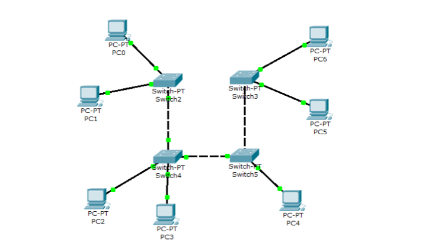

## Лабораторная работа №1 "Базовая настройка ip-телефонов в среде Сisco packet tracer"

### Описание
Для выполнения данной лабораторной работы собирается схема соединения. Необходимо проверить, правильно ли подключены и настроены все узлы устройств.

### Цель работы
Изучить рабочую среду Cisco Packet Tracer, ознакомить- ся с интерфейсами основных устройств, типами кабелей, научиться собирать топологию. Изучить построение сети IP-телефонии с помощью маршрутизатора, коммутатора и IP телефонов Cisco 7960 в среде Packet tracer

### Правила по оформлению
Правила по оформлению отчета по лабораторной работе вы можете изучить по [ссылке](../reportdesign.md)

### Ход работы

#### Часть 1

1. Изучить теоретическую и практическую части лабораторной работы.
2. Собрать схему соединения.
3. Научиться настраивать коммутаторы и компьютеры для полноценной работы сети.
4. Научиться применять основной список команд для конфигурирования устройств сети.
5. После выполнения необходимых настроек необходимо убедиться в том, что любой компьютер одной сети посредством пинга передает пакеты любому компьютеру другой сети.

#### Часть 2 

1. Собрать схему соединения, указанную на рисунке
2. Изменить имя маршрутизатора на CMERouter.
3. Настроить интерфейс fa0/0 на маршрутизаторе Cisco 2811 (CMERouter).
4. Настроить DHCP сервера для передачи голоса и данных на маршрутизаторе - Cisco 2811.
5. Настроить услуги телефонии Cisco CallManager Express на маршрутизаторе 2811.
6. Настроить маршрутизацию сети.
7. Создать VLAN порты на коммутаторе для взаимодействия коммутатора с маршрутизатором и подключить IP телефоны.
8. Настроить IP-телефоны, присвоить им номера и соединить с коммутатором.
9. Проверить звонки между телефонами и проверить остальные сервисы (перевод звонков, конференц-связь, перехват звонка).

### Результаты лабораторной работы
В результате лабораторной работы у вас должна получиться схемы связи следующего вида:

### Схема 1

### Схема 2

-Результаты пингов.

-Результаты звонков.

-Схема связи нарисованная вами в draw.io или Visio.

