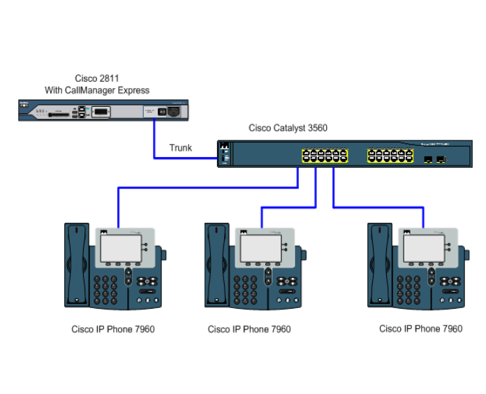
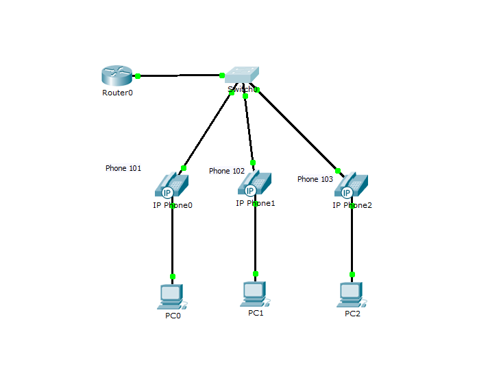

## Лабораторная работа №2 "Конфигурация voip в среде Сisco packet tracer"

### Описание
Для выполнения данной лабораторной работы собирается схема соединения. Необходимо проверить, правильно ли подключены все узлы устройств. Предварительно удалить все преды- дущие конфигурационные файлы на маршрутизаторах Cisco 2811, на коммутаторе Cisco catalyst 3560.

### Цель работы
Иизучить построение сети IP-телефонии с помощью маршрутизатора Cisco 2811, коммутатора Cisco catalyst 3560 и IP телефонов Cisco 7960.

### Правила по оформлению
Правила по оформлению отчета по лабораторной работе вы можете изучить по [ссылке](../reportdesign.md)

### Ход работы

#### Часть 1

1. В конфигурационном режиме измените название маршру- тизатора на CMERouter.
2. Отключите синтаксис ввода слов от DNS серверов.
3. Задайте пароли для защиты маршрутизатора как в удаленном режиме, так и в режиме консоли.
4. Настройте интерфейс fa0/0 на маршрутизаторе Cisco 2811 (CMERouter).
5. Настроить DHCP сервера для передачи голоса и данных на маршрутизаторе Cisco 2811.
6. Настроить услуги телефонии Cisco CallManager Express на маршрутизаторе 2811.
7. Создать VLAN порты на коммутаторе Cisco Catalyst 3560 для взаимодействия коммутатора с маршрутизатором и подключить IP телефоны.
8. Настроить IP-телефоны и соединить с коммутатором Cisco Catalyst 3560.
9. Проверить звонки между телефонами и проверить остальные сервисы (перевод звонков, конференц-связь, перехват звонка).

#### Часть 2 

1. Создать VLAN порты на коммутаторе для взаимо- действия коммутатора с маршрутизатором и подключить IP телефоны.
2. Задайте маршрут по умолчанию командой ip default-gateway.
3. Настройте порт как канал типа trunk.
4. Настроить DHCP сервера для передачи голоса и данных на маршрутизаторе Cisco 2811.
5. Настроить услуги телефонии Cisco CallManager Express на маршрутизаторе.
6. Настроить IP-телефоны и соединить с коммутатором.
7. Подключить конечные узлы устройств.
8. Проверить звонки между телефонами и проверить остальные сервисы (перевод звонков, конференц-связь, перехват звонка).

### Результаты лабораторной работы
В результате лабораторной работы у вас должна получиться схемы связи следующего вида:

### Схема 1

### Схема 2

-Результаты пингов.

-Результаты звонков.

-Схема связи нарисованная вами в draw.io или Visio.

